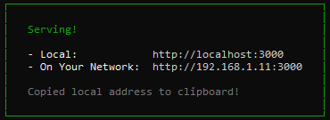

# Dependencies

This repository uses Node.js and its package manager, Node Package Manager (npm), to manage the JavaScript module dependencies and the building of the project. For this, you need to download Node.js to your development environment. The latest version of Node.js is available for download at the link below.

[https://nodejs.org/en/](https://nodejs.org/en/)

This application uses WebXR to acheive its Augmented Reality (AR) features. To interact with the application, a smartphone with a WebXR-compatible browser is required. If your browser does not support WebXR, you may need to download a new one. XRViewer offered on iOS is known to work.

# Building and Running

Node.js, specifically its build manager, GYP (gyp), handles the building of the application. No particular steps are required to build the application.

To run and serve the application at a port on the host network, execute the following steps:

1.  Navigate to directory ~/PsycheProj and run command "npm install package-lock.json". This installs all packages necessary to the application listed in package-lock.json.

2.  In the same directory, run command "npx serve". This runs the application and serves it at a port on the host machine. When successful, this will produce the result shown below.

3.  The application can then be accessed at the location described in the CLI.

4.  If you can't access the application because of inability to establish a secure connection, you may need an SSL certificate. For this issue, execute the following steps:

    1. Download ngrok: [https://ngrok.com/download](https://ngrok.com/download)
    2. Run command "ngrok http 3000" at the same directory as previous steps. This secures port 3000 for public use.
